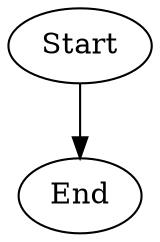
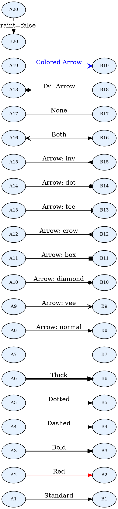

# Your First Graphviz Diagrams

*From Basics to Azure Components*  

## 1. The "Hello World" of Graphviz

Create a file `hello.dot`:  



Generate the image:  

```bash
dot -Tpng hello.dot -o hello.png
```  

## 2. Basic Elements Explained  

### Nodes (Shapes)  

```dot
digraph Shapes {
    rankdir=LR;
    node [style=filled, fillcolor=lightgray, fontsize=10];

    // Basic Shapes
    box        [label="box", shape=box];
    ellipse    [label="ellipse", shape=ellipse];
    oval       [label="oval", shape=oval];
    circle     [label="circle", shape=circle];
    plaintext  [label="plaintext", shape=plaintext];
    diamond    [label="diamond", shape=diamond];
    triangle   [label="triangle", shape=triangle];
    trapezium  [label="trapezium", shape=trapezium];
    parallelogram [label="parallelogram", shape=parallelogram];
    house      [label="house", shape=house];
    hexagon    [label="hexagon", shape=hexagon];
    octagon    [label="octagon", shape=octagon];
    doubleoctagon [label="doubleoctagon", shape=doubleoctagon];
    egg        [label="egg", shape=egg];
    note       [label="note", shape=note];
    tab        [label="tab", shape=tab];
    folder     [label="folder", shape=folder];
    box3d      [label="box3d", shape=box3d];
    component  [label="component", shape=component];
    Mrecord    [label="Mrecord", shape=Mrecord];  // legacy, prefer 'record'

    // Database and Technology
    cylinder   [label="cylinder", shape=cylinder];
    invtrapezium [label="invtrapezium", shape=invtrapezium];
    invtriangle [label="invtriangle", shape=invtriangle];

    // Records and complex layout
    record     [label="record", shape=record];

    // Circular group
    subgraph cluster_circles {
        label="Circle-based"
        style=dashed
        circle;
        oval;
        egg;
    }

    // Box group
    subgraph cluster_boxes {
        label="Box-based"
        style=dashed
        box;
        box3d;
        folder;
        component;
        note;
        tab;
        record;
    }
}

```  



### Edges (Connections)  



## 3. Common Errors & Fixes  

| Problem | Solution |  
|---------|----------|  
| Overlapping nodes | Add `splines=true;` to diagram |  
| Misaligned arrows | Use `rank=same;` for peer nodes |  
| Text cutoff | Increase `margin` attribute |  
