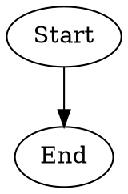
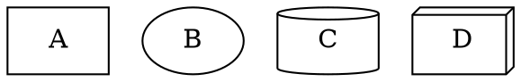
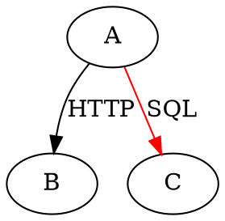
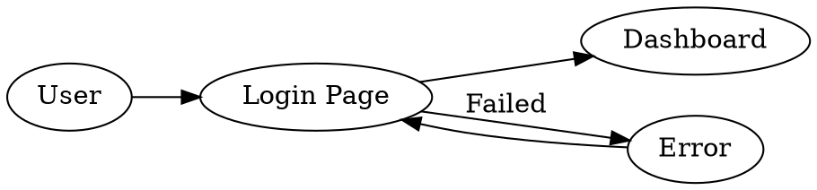
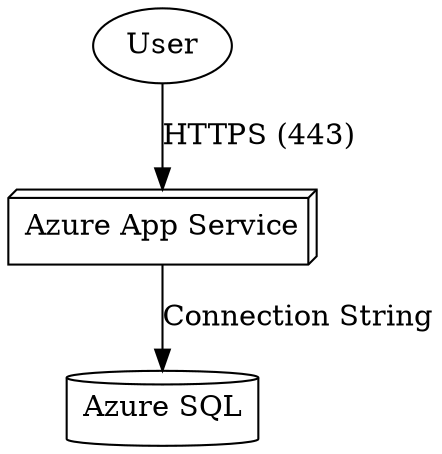
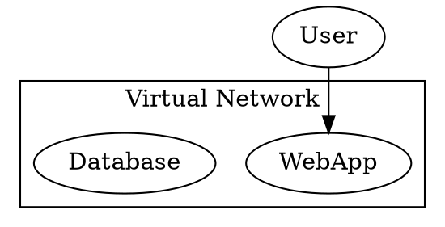

# Your First Graphviz Diagrams

*From Basics to Azure Components*  

## 1. The "Hello World" of Graphviz

Create a file `hello.dot`:  



Generate the image:  

```bash
dot -Tpng hello.dot -o hello.png
```  

## 2. Basic Elements Explained  

### Nodes (Shapes)  



### Edges (Connections)  



## 3. Your First Flow Diagram  



## 4. Azure-Relevant Example  

### Basic Web App + Database  



Key Features:  

- `box3d`: Standard shape for Azure resources  
- `cylinder`: Database representation  
- Explicit port labels (HTTPS)  

## 5. Layout Tips for Azure Diagrams  

### Grouping with Subgraphs  



### Direction Control  

```bash
# Command-line options
dot -Grankdir=LR -Tpng diagram.dot -o diagram.png 
```  

OR in-file:  

```dot
digraph {
    rankdir="LR"; // Alternatives: TB (top-bottom), RL (right-left)
}
```  

## 6. Common Errors & Fixes  

| Problem | Solution |  
|---------|----------|  
| Overlapping nodes | Add `splines=true;` to diagram |  
| Misaligned arrows | Use `rank=same;` for peer nodes |  
| Text cutoff | Increase `margin` attribute |  
