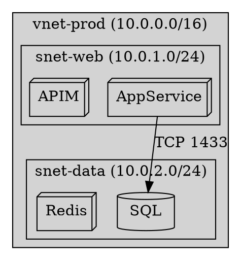
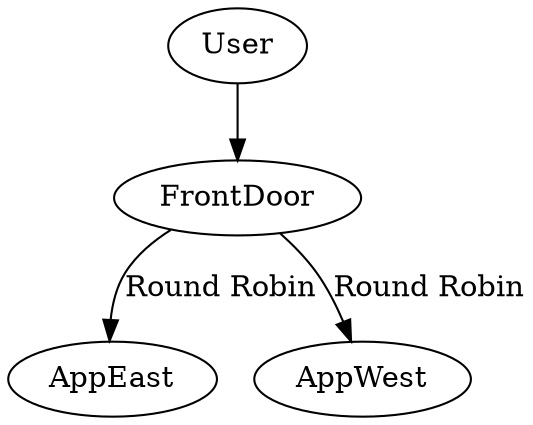
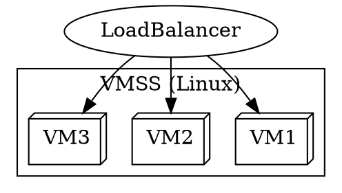
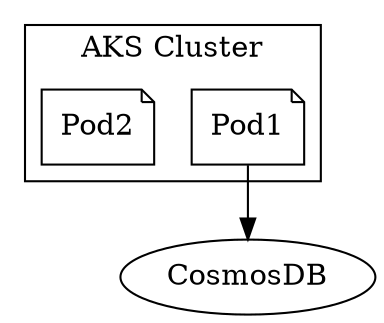
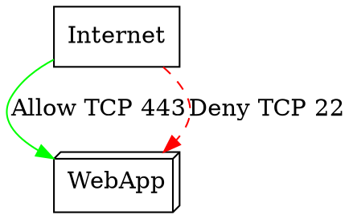
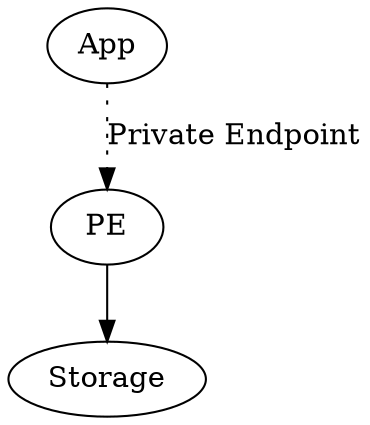
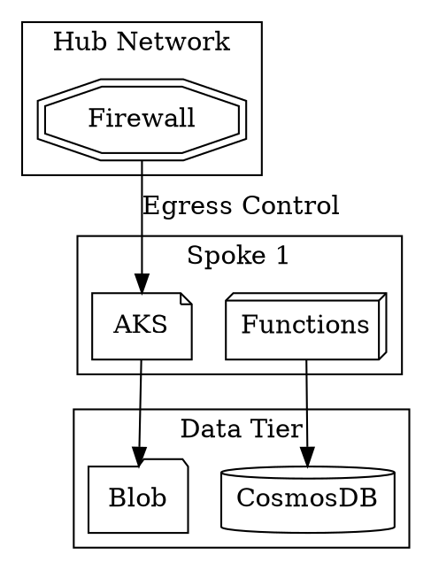

# Azure Common Components in Graphviz  

## Templates for Key Azure Services

## 1. Networking Components

### Virtual Network with Subnets



Key Features:

- `cluster_*` for visual grouping
- IP range labels
- Protocol-specific ports

### Load Balancers



---

## 2. Compute Services

### VM Scale Set



### Container Services



---

## 3. Storage & Databases

### Storage Account Services

```dot
digraph StorageExample {
    rankdir=LR;
    
    App -> {
        Blob [shape=folder, label="Blob Storage"],
        Queue [shape=box, label="Queue"],
        Table [shape=plaintext, label="Table"]
    };
}
```

### Database Tier

```dot
digraph DatabaseTier {
    App -> {
        SQL [shape=cylinder, label="Azure SQL"],
        Cosmos [shape=cylinder, label="Cosmos DB"],
        PostgreSQL [shape=cylinder, label="Flexible Server"]
    };
}
```

---

## 4. Security Components

### NSG Rules



### Private Endpoints



---

## 5. Complete Azure Architecture



---

## Best Practices

1. Consistent Naming:

   ```bash
   // Good
   AppService_Prod [shape=box3d];
   
   // Avoid
   App1 [shape=box];
   ```

2. Color Coding:

   ```bash
   node [color="#0078D4"]; // Azure blue
   security [color="#FF0000"]; // Red for security
   ```

3. Layered Outputs:

   ```bash
   # Generate multiple formats
   dot -Tpng arch.dot -o arch.png
   dot -Tsvg arch.dot -o arch.svg
   ```
