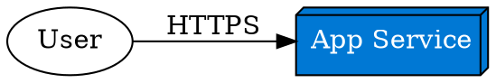
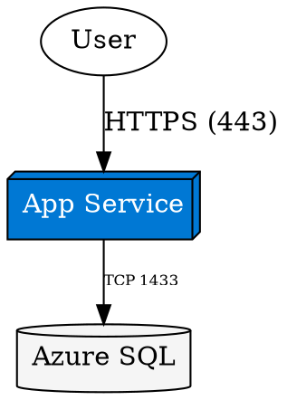
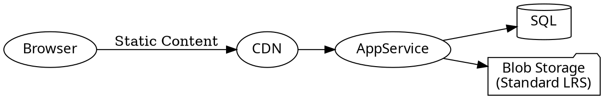
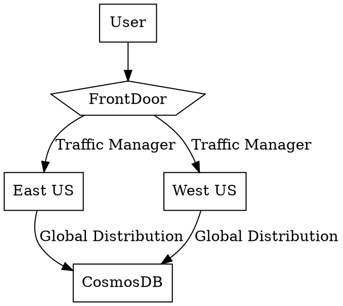
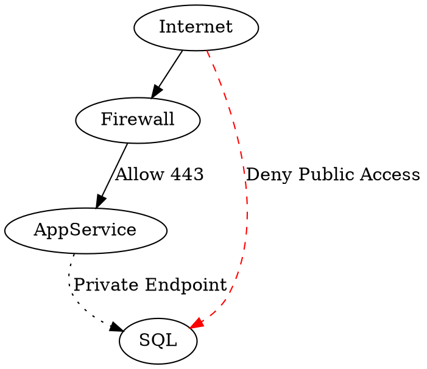
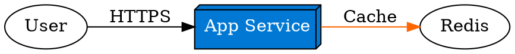
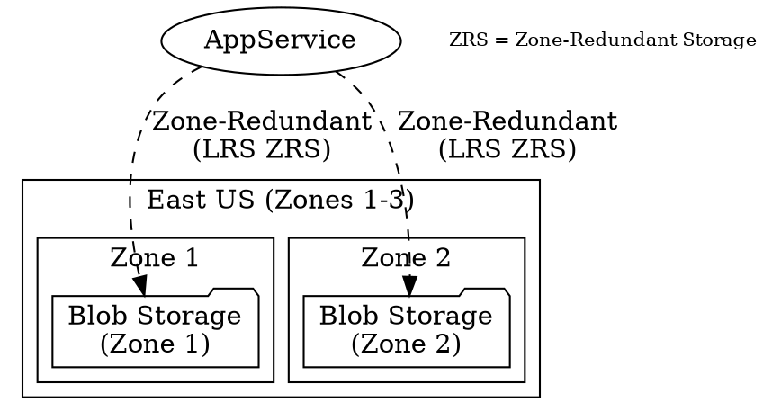
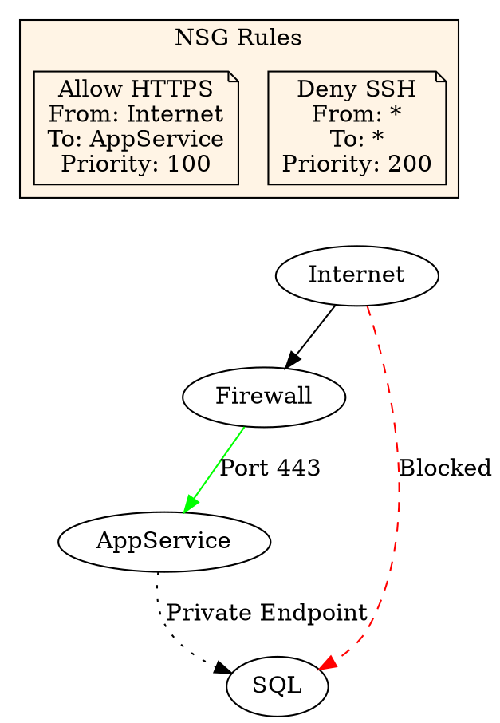

# **Simple Azure Diagrams in Graphviz**  

## **1. Starter Template: Single Azure Service**  

### **Basic App Service Diagram**  



**Key Elements:**  

- `box3d`: Standard Azure resource shape  
- `fillcolor="#0078D4"`: Microsoft Azure blue  
- Explicit protocol labeling  

## **2. Adding a Database Tier**  

### **Web App + Database**  



**Pro Tip:** Use **port numbers** for clarity in security reviews.

## **3. Including Storage**  

### **Three-Tier Architecture**  



## **4. Basic Availability Design**  

### **Load Balanced Web Apps**  



**Visual Cues:**  

- pentagon: Load balancer shape  
- Region labels for geo-redundancy  

## **5. Adding Security Elements**  

### **With Network Restrictions**  



## **Common Modifications Table**  

| Scenario | Graphviz Code Snippet |  
|----------|-----------------------|  
| **Add Monitoring** | `App -> LogAnalytics [label="Diagnostics", style=dashed]` |  
| **Private Link** | `Storage -> PE [label="Private Endpoint", dir=both]` |  
| **Zone Redundancy** | `SQL [label="Azure SQL\nZone-Redundant"]` |  

## **Try These Exercises**  

1. **Modify the Three-Tier diagram** to include Redis Cache  
2. **Create a zone-redundant** storage diagram  
3. **Add NSG rules** to the security example  

**Solution for #1:**  



**Solution for #2:**  



**Solution for #3:**  



**Pro Tip:** Use this command to generate high-res diagrams:  

```bash
dot -Tpng -Gdpi=300 diagram.dot -o diagram.png
```
