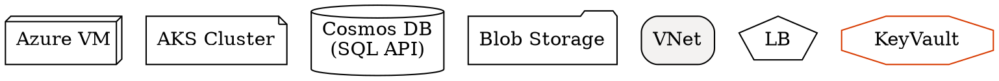
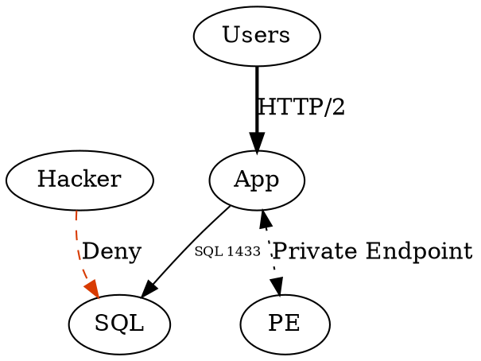
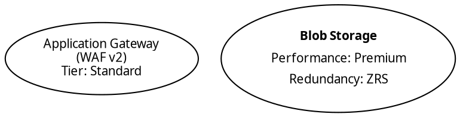
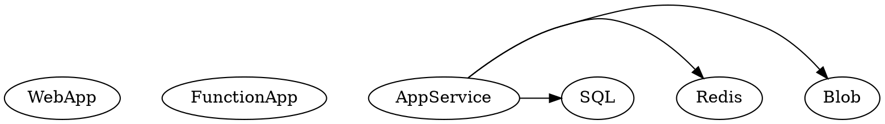
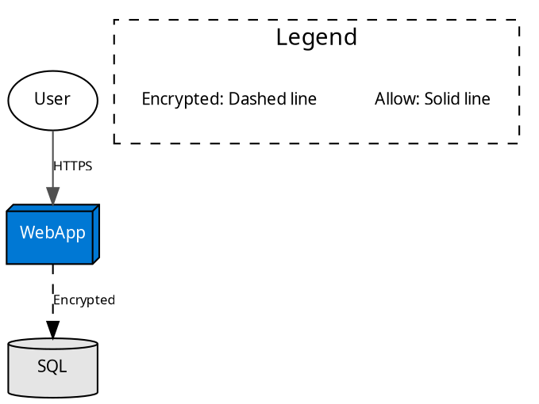

# Professional Styling Guide for Azure Diagrams  

## 1. Azure Brand Colors  

### Official Microsoft Palette  


Color Reference:  

| Purpose | Hex Code |  
|---------|----------|  
| Primary Azure Blue | `#0078D4` |  
| Dark Contrast | `#106EBE` |  
| Alert/Deny | `#D83B01` (Orange) |  
| Allow/Success | `#107C10` (Green) |  

## 2. Node Styles by Component Type  

### Standardized Shapes  



Shape Convention:  

- `box3d`: All Azure resources (VMs, App Services)  
- `cylinder`: Databases (SQL, CosmosDB)  
- `folder`: Storage services  
- `pentagon`: Load balancers/Front Door  

## 3. Edge Styling for Clarity  

### Connection Types  



Edge Rules:  

| Scenario | Style |  
|----------|-------|  
| Encrypted | `style=dashed` |  
| Private Link | `style=dotted` |  
| High bandwidth | `penwidth=2.5` |  
| Cross-region | `color="#8E8E8E"` (Gray) |  

## 4. Typography & Labels

### Readable Text Formatting  



Pro Tips:  

- Use `\n` for line breaks in simple labels  
- HTML-like (`<table>`) for complex labels  
- Bold primary resource names  

## 5. Layout Optimization  

### Professional Spacing  



Layout Commands:  

```bash
# Command-line options
dot -Gnodesep=1.0 -Gsplines=ortho -Tpng input.dot -o output.png
```

## 6. Full Example: Styled Azure Architecture  



## 7. Troubleshooting Visual Issues  

| Problem | Solution |  
|---------|----------|  
| Cluttered nodes | Increase `nodesep` and `ranksep` |  
| Label overlap | Add `labelangle=15, labeldistance=2.5` |  
| Color bleed | Use `gradientangle=270` for gradients |  
| Arrow misalignment | Set `constraint=false` on problem edges |  

Pro Tip: For print-ready diagrams:  

```bash
dot -Tpdf -Gdpi=600 -Nfontsize=12 styled.dot -o print.pdf
```
