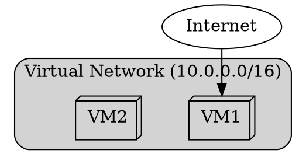
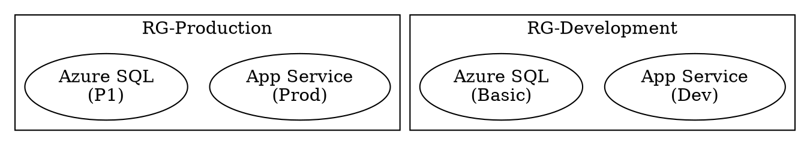
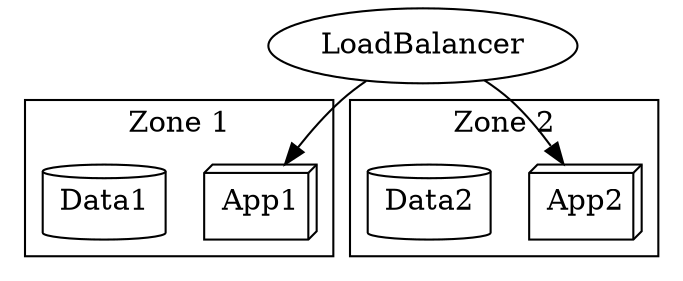
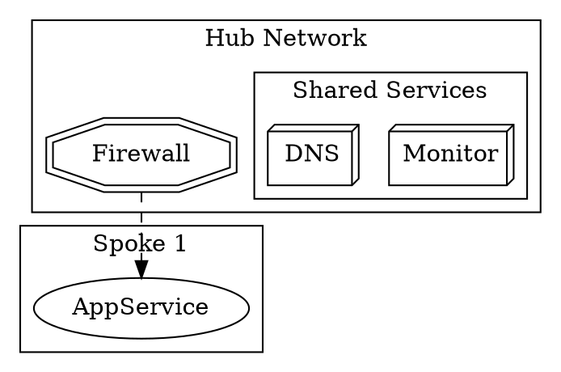
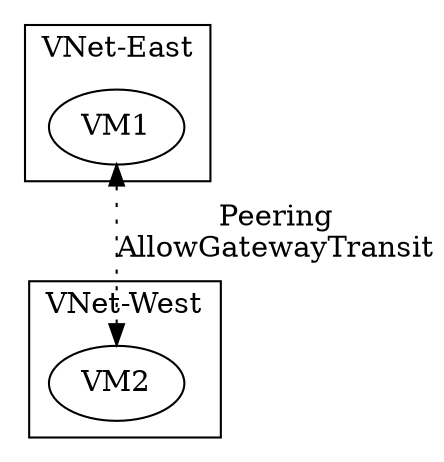
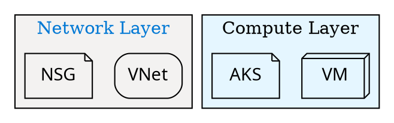
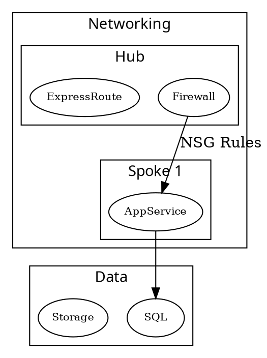
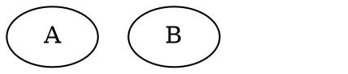
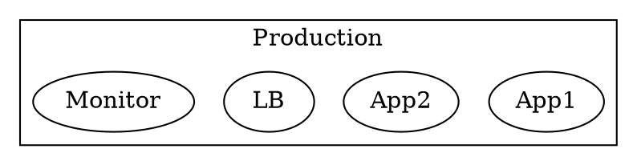

# Mastering Subgraphs for Azure Diagrams  

## 1. Basic Subgraph Syntax  

### Virtual Network Container  



Key Features:  

- `cluster_` prefix triggers visual containment  
- Customizable label position (`labeljust`, `labelloc`)  
- Background/border styling  

## 2. Azure-Specific Groupings  

### Resource Group Organization  



### Availability Zone Layout  



## 3. Nested Subgraphs  

### Hub-Spoke Network  



## 4. Cross-Subgraph Connections  

### Peering Relationships  



Pro Tip: Use `constraint=false` to prevent layout distortion:  

```dot
Frontend -> Backend [constraint=false];
```

## 5. Styling Subgraphs  

### Consistent Visual Language  



## 6. Practical Azure Examples  

### Full Architecture with Subgraphs  



## 7. Troubleshooting Subgraphs  

| Issue | Solution |  
|-------|----------|  
| Border missing | Ensure `cluster_` prefix is used |  
| Label cutoff | Increase `labelloc` or reduce font size |  
| Overlap | Add `compound=true` to graph |  
| Arrow gaps | Use `lhead`/`ltail` attributes |  

Example Fix:  

```dot
graph [compound=true];
App -> DB [lhead=cluster_db];
```

## 8. Advanced Techniques  

### Invisible Subgraphs for Layout  



### Conditional Display  


