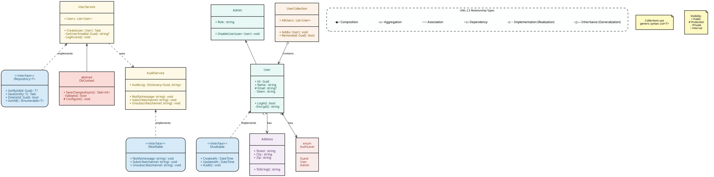

# Class diagram

```dot
digraph UMLClassDiagram {
    rankdir=TB;
    fontname="Segoe UI";
    bgcolor="white";
    compound=true;
    nodesep=0.5;
    ranksep=0.8;

    node [
        shape=record, 
        fontname="Segoe UI", 
        fontsize=10,
        penwidth=1.2,
        margin=0.2
    ];
    
    edge [
        fontname="Segoe UI", 
        fontsize=9, 
        color="#555555", 
        arrowsize=0.8,
        penwidth=1.0
    ];

    // ========== INTERFACES ==========
    IRepository [
        label="{\<\<interface\>\>\nIRepository\<T\>|
+ GetById(id: Guid) : T?\l
+ Save(entity: T) : Task\l
+ Delete(id: Guid) : bool\l
+ GetAll() : IEnumerable\<T\>\l}",
        fillcolor="#D6EAF8", 
        fontcolor="#1B4F72",
        style="filled,rounded"
    ];

    IAuditable [
        label="{\<\<interface\>\>\nIAuditable|
+ CreatedAt : DateTime\l
+ UpdatedAt : DateTime\l
+ Audit() : void\l}",
        fillcolor="#D6EAF8", 
        fontcolor="#1B4F72",
        style="filled,rounded"
    ];

    INotifiable [
        label="{\<\<interface\>\>\nINotifiable|
+ Notify(message: string) : void\l
+ Subscribe(channel: string) : void\l
+ Unsubscribe(channel: string) : void\l}",
        fillcolor="#D6EAF8", 
        fontcolor="#1B4F72",
        style="filled,rounded"
    ];

    // ========== ABSTRACT CLASS ==========
    AbstractDbContext [
        label="{abstract\nDbContext|
+ SaveChangesAsync() : Task\<int\>\l
- Validate() : bool\l
# Configure() : void\l}",
        fillcolor="#FADBD8", 
        fontcolor="#922B21",
        style="filled"
    ];

    // ========== CLASSES ==========
    User [
        label="{User|
+ Id : Guid\l
+ Name : string\l
# Email : string?\l
- Token : string\l|
+ Login() : bool\l
- Encrypt() : string\l}",
        fillcolor="#E8F8F5", 
        fontcolor="#0B5345",
        style="filled"
    ];

    Admin [
        label="{Admin|
+ Role : string\l|
+ DisableUser(user: User) : void\l}",
        fillcolor="#E8F8F5", 
        fontcolor="#0B5345",
        style="filled"
    ];

    UserService [
        label="{UserService|
+ Users : List\<User\>\l|
+ Create(user: User) : Task\l
- GetUserEmail(id: Guid) : string?\l
- LogAccess() : void\l}",
        fillcolor="#FEF9E7", 
        fontcolor="#7D6608",
        style="filled"
    ];

    AuditService [
        label="{AuditService|
+ AuditLog : Dictionary\<Guid, string\>\l|
+ Notify(message: string) : void\l
+ Subscribe(channel: string) : void\l
+ Unsubscribe(channel: string) : void\l}",
        fillcolor="#FEF9E7", 
        fontcolor="#7D6608",
        style="filled"
    ];

    // ========== VALUE TYPES ==========
    Address [
        label="{Address|
+ Street : string\l
+ City : string\l
+ Zip : string\l|
+ ToString() : string\l}",
        fillcolor="#F4ECF7", 
        fontcolor="#512E5F",
        style="filled"
    ];

    AuthLevel [
        label="{enum\nAuthLevel|
Guest\l
User\l
Admin\l}",
        fillcolor="#F9EBEA", 
        fontcolor="#943126",
        style="filled"
    ];

    // ========== COLLECTIONS ==========
    UserCollection [
        label="{UserCollection|
+ AllUsers : List\<User\>\l|
+ Add(u: User) : void\l
+ Remove(id: Guid) : bool\l}",
        fillcolor="#FDF2E9", 
        fontcolor="#7E5109",
        style="filled"
    ];

    // ========== RELATIONSHIPS ==========
    // Inheritance
    Admin -> User [
        arrowhead=empty,
        style=solid,
        dir=back
    ];

    UserService -> AbstractDbContext [
        arrowhead=empty,
        style=solid,
        dir=back
    ];

    // Interface Implementation
    User -> IAuditable [
        arrowhead=empty,
        style=dashed,
        dir=back,
        label="implements"
    ];

    AuditService -> INotifiable [
        arrowhead=empty,
        style=dashed,
        dir=back,
        label="implements"
    ];

    UserService -> IRepository [
        arrowhead=empty,
        style=dashed,
        dir=back,
        label="implements"
    ];

    // Dependency
    UserService -> AuditService [
        arrowhead=vee,
        style=dashed,
        label="uses"
    ];

    // Association
    User -> Address [
        arrowhead=vee,
        style=solid,
        headlabel="1",
        taillabel="1..*",
        label="has"
    ];

    // Aggregation
    UserCollection -> User [
        arrowtail=odiamond,
        arrowhead=vee,
        dir=both,
        label="contains"
    ];

    // Composition
    User -> AuthLevel [
        arrowtail=diamond,
        arrowhead=vee,
        dir=both,
        headlabel="1",
        taillabel="1",
        label="has"
    ];

    // ========== LEGEND ==========
    subgraph cluster_legend {
        label="UML 2.5 Relationship Types";
        style="rounded,dashed";
        bgcolor="#FDFEFE";
        fontname="Segoe UI";
        fontsize=9;
        margin=10;

        node [shape=plaintext];
        
        Generalization [label="◁|— Inheritance (Generalization)"];
        Realization [label="◁┈┈ Implementation (Realization)"];
        Dependency [label="╶─▷ Dependency"];
        Association [label="╶── Association"];
        Aggregation [label="╶◇─ Aggregation"];
        Composition [label="╶◆─ Composition"];
    }

    // ========== NOTES ==========
    subgraph cluster_notes {
        label="";
        style="invis";
        
        Note1 [
            shape=note,
            label="Visibility:\n+ Public\n# Protected\n- Private\n~ Internal",
            fillcolor="#FFF9C4",
            style="filled",
            fontsize=9
        ];
        
        Note2 [
            shape=note,
            label="Collections use\ngeneric syntax: List\<T\>",
            fillcolor="#FFF9C4",
            style="filled",
            fontsize=9
        ];
    }
}
```
