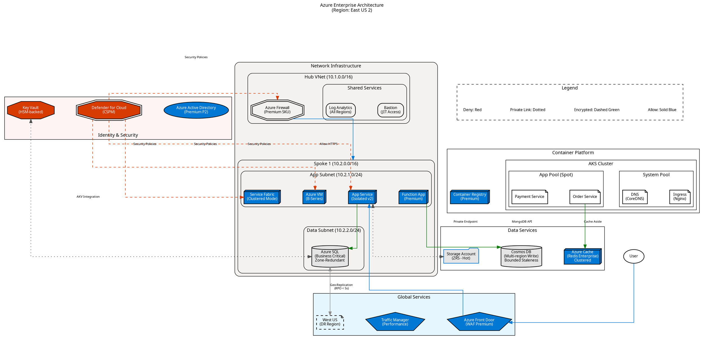

# Advanced Azure Architecture with Graphviz

```dot
digraph EnterpriseAzureArch {
    // ========== GLOBAL SETTINGS ==========
    graph [
        fontname="Segoe UI",
        fontsize=12,
        label="Azure Enterprise Architecture\n(Region: East US 2)",
        labelloc="t",
        compound=true,
        nodesep=0.8,
        ranksep=1.2,
        splines=ortho
    ];

    node [
        fontname="Segoe UI",
        fontsize=10,
        penwidth=1.5,
        fontcolor="black"
    ];

    edge [
        fontname="Segoe UI",
        fontsize=8,
        penwidth=1.2,
        fontcolor="black",
        color="#505050"
    ];

    // IDENTITY
    subgraph cluster_identity {
        label="Identity & Security";
        bgcolor="#FFF4F4";
        labelloc="b";

        AAD [label="Azure Active Directory\n(Premium P2)", shape=oval, style=filled, fillcolor="#0078D4", fontcolor=white];
        KeyVault [label="Key Vault\n(HSM-backed)", shape=octagon, style=filled, fillcolor="#D83B01", fontcolor="white"];
        Defender [label="Defender for Cloud\n(CSPM)", shape=doubleoctagon, style=filled, fillcolor="#D83B01", fontcolor="white"];
    }

    // NETWORK
    subgraph cluster_network {
        label="Network Infrastructure";
        bgcolor="#F3F2F1";
        style="rounded,filled";

        subgraph cluster_hub {
            label="Hub VNet (10.1.0.0/16)";

            Firewall [label="Azure Firewall\n(Premium SKU)", shape=doubleoctagon, style=filled, fillcolor="#F3F2F1"];

            subgraph cluster_shared_services {
                label="Shared Services";
                Bastion [label="Bastion\n(JIT Access)", shape=box, style="rounded,filled", fillcolor="#F3F2F1"];
                Monitor [label="Log Analytics\n(All Regions)", shape=box, style="rounded,filled", fillcolor="#F3F2F1"];
            }
        }

        subgraph cluster_spoke1 {
            label="Spoke 1 (10.2.0.0/16)";

            subgraph cluster_app_tier {
                label="App Subnet (10.2.1.0/24)";
                AppService [label="App Service\n(Isolated v2)", shape=box3d, style=filled, fillcolor="#0078D4", fontcolor="white"];
                Function [label="Function App\n(Premium)", shape=box3d, style=filled, fillcolor="#0078D4", fontcolor="white"];
                ServiceFabric [label="Service Fabric\n(Clustered Mode)", shape=box3d, style=filled, fillcolor="#0078D4", fontcolor="white"];
                AzureVM [label="Azure VM\n(B-Series)", shape=box3d, style=filled, fillcolor="#0078D4", fontcolor="white"];
            }

            subgraph cluster_data_tier {
                label="Data Subnet (10.2.2.0/24)";
                SQL [label="Azure SQL\n(Business Critical)\nZone-Redundant", shape=cylinder, style=filled, fillcolor="#E5E5E5"];
            }
        }

        Firewall -> AppService [label="Allow HTTPS", lhead=cluster_spoke1, color="#0078D4"];
    }

    // GLOBAL SERVICES
    subgraph cluster_global {
        label="Global Services";
        bgcolor="#E5F6FF";

        FrontDoor [label="Azure Front Door\n(WAF Premium)", shape=pentagon, style=filled, fillcolor="#0078D4", fontcolor=white];
        TrafficManager [label="Traffic Manager\n(Performance)", shape=pentagon, style=filled, fillcolor="#0078D4", fontcolor=white];
        WestRegion [label="West US\n(DR Region)", shape=note, style=dashed];
    }

    // DATA
    subgraph cluster_data {
        label="Data Services";

        CosmosDB [label="Cosmos DB\n(Multi-region Write)\nBounded Staleness", shape=cylinder, style=filled, fillcolor="#E5E5E5"];
        Storage [label="Storage Account\n(ZRS - Hot)", shape=folder, style=filled, fillcolor="#E5E5E5", color="#0078D4"];
        Redis [label="Azure Cache\n(Redis Enterprise)\nClustered", shape=box3d, style=filled, fillcolor="#0078D4", fontcolor=white];
    }

    // CONTAINERS
    subgraph cluster_containers {
        label="Container Platform";

        subgraph cluster_aks {
            label="AKS Cluster";

            subgraph cluster_system_nodes {
                label="System Pool";
                SystemPod1 [label="Ingress\n(Nginx)", shape=note];
                SystemPod2 [label="DNS\n(CoreDNS)", shape=note];
            }

            subgraph cluster_app_nodes {
                label="App Pool (Spot)";
                AppPod1 [label="Order Service", shape=note];
                AppPod2 [label="Payment Service", shape=note];
            }
        }

        ACR [label="Container Registry\n(Premium)", shape=box3d, style=filled, fillcolor="#0078D4", fontcolor=white];
    }

    // CONNECTIONS
    edge [color="#0078D4"];
    User -> FrontDoor -> AppService;

    edge [color="#107C10"];
    AppService -> SQL;
    Function -> CosmosDB [label="MongoDB API"];
    AppPod1 -> Redis [label="Cache Aside"];

    edge [color="#D83B01", style="dashed"];
    Defender -> {Firewall AppService ServiceFabric AzureVM} [label="Security Policies"];

    edge [color="#505050", style="dotted", dir="both"];
    SQL -> KeyVault [label="AKV Integration"];
    Storage -> AppService [label="Private Endpoint"];

    edge [color="#8E8E8E", style="bold"];
    SQL -> WestRegion [label="Geo-Replication\n(RPO < 5s)"];

    // LEGEND
    subgraph cluster_legend {
        label="Legend";
        style="dashed";
        rank="sink";

        Allow [shape=plaintext, label="Allow: Solid Blue"];
        Encrypt [shape=plaintext, label="Encrypted: Dashed Green"];
        PrivateLink [shape=plaintext, label="Private Link: Dotted"];
        Block [shape=plaintext, label="Deny: Red"];
    }
}
```
