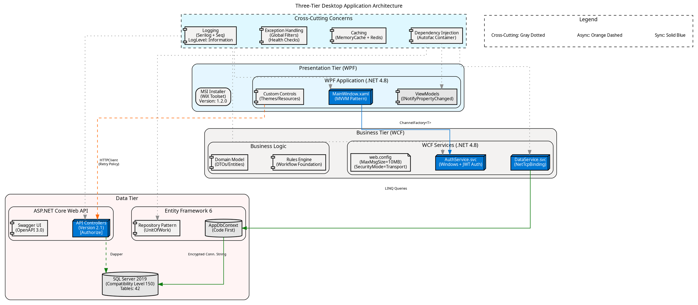

# Three-Tier Enterprise Desktop Application

```dot
// =============================================
// Updated: Three-Tier Desktop Architecture with Orthogonal Edges
// =============================================
digraph EnterpriseDesktopArch {
    // ========== GLOBAL SETTINGS ==========
    graph [
        fontname="Segoe UI",
        fontsize=12,
        label="Three-Tier Desktop Application Architecture",
        labelloc="t",
        compound=true,
        nodesep=0.8,
        ranksep=1.0,
        splines=ortho
    ];
    
    node [
        fontname="Segoe UI",
        fontsize=10,
        penwidth=1.5,
        fontcolor="black"
    ];
    
    edge [
        fontname="Segoe UI",
        fontsize=8,
        penwidth=1.2,
        fontcolor="black"
    ];

    // ========== PRESENTATION TIER ==========
    subgraph cluster_presentation {
        label="Presentation Tier (WPF)";
        bgcolor="#E5F6FF";
        style="rounded,filled";

        subgraph cluster_wpf {
            label="WPF Application (.NET 4.8)";
            
            MainWindow [
                shape=box3d,
                label="MainWindow.xaml\n(MVVM Pattern)",
                style="filled",
                fillcolor="#0078D4",
                fontcolor="white"
            ];
            
            ViewModels [
                shape=component,
                label="ViewModels\n(INotifyPropertyChanged)",
                style="filled",
                fillcolor="#E5E5E5"
            ];
            
            CustomControls [
                shape=component,
                label="Custom Controls\n(Themes/Resources)",
                style="filled",
                fillcolor="#F3F2F1"
            ];
        }

        Installer [
            shape=box,
            label="MSI Installer\n(WiX Toolset)\nVersion: 1.2.0",
            style="rounded,filled",
            fillcolor="#F3F2F1"
        ];
    }

    // ========== BUSINESS TIER ==========
    subgraph cluster_business {
        label="Business Tier (WCF)";
        bgcolor="#F3F2F1";
        style="rounded,filled";

        subgraph cluster_wcf {
            label="WCF Services (.NET 4.8)";
            
            AuthService [
                shape=box3d,
                label="AuthService.svc\n(Windows + JWT Auth)",
                style="filled",
                fillcolor="#0078D4",
                fontcolor="white"
            ];
            
            DataService [
                shape=box3d,
                label="DataService.svc\n(NetTcpBinding)",
                style="filled",
                fillcolor="#0078D4",
                fontcolor="white"
            ];
            
            WCFConfig [
                shape=note,
                label="web.config\n(MaxMsgSize=10MB)\n(SecurityMode=Transport)"
            ];
        }

        subgraph cluster_logic {
            label="Business Logic";
            
            RulesEngine [
                shape=component,
                label="Rules Engine\n(Workflow Foundation)",
                style="filled",
                fillcolor="#F3F2F1"
            ];
            
            DomainModel [
                shape=component,
                label="Domain Model\n(DTOs/Entities)",
                style="filled",
                fillcolor="#F3F2F1"
            ];
        }
    }

    // ========== DATA TIER ==========
    subgraph cluster_data {
        label="Data Tier";
        bgcolor="#FFF4F4";
        style="rounded,filled";

        subgraph cluster_ef {
            label="Entity Framework 6";

            DbContext [
                shape=cylinder,
                label="AppDbContext\n(Code First)",
                style="filled",
                fillcolor="#E5E5E5"
            ];
            
            Repositories [
                shape=component,
                label="Repository Pattern\n(UnitOfWork)",
                style="filled",
                fillcolor="#F3F2F1"
            ];
        }

        SQLServer [
            shape=cylinder,
            label="SQL Server 2019\n(Compatibility Level 150)\nTables: 42",
            style="filled",
            fillcolor="#E5E5E5"
        ];

        subgraph cluster_webapi {
            label="ASP.NET Core Web API";
            
            APIControllers [
                shape=box3d,
                label="API Controllers\n(Version 2.1)\n[Authorize]",
                style="filled",
                fillcolor="#0078D4",
                fontcolor="white"
            ];
            
            Swagger [
                shape=component,
                label="Swagger UI\n(OpenAPI 3.0)",
                style="filled",
                fillcolor="#F3F2F1"
            ];
        }
    }

    // ========== CROSS-CUTTING ==========
    subgraph cluster_cross {
        label="Cross-Cutting Concerns";
        bgcolor="#DFF8FF";
        style="dashed";

        Logging [
            shape=component,
            label="Logging\n(Serilog + Seq)\nLogLevel: Information",
            style="filled",
            fillcolor="#F3F2F1"
        ];

        Caching [
            shape=component,
            label="Caching\n(MemoryCache + Redis)",
            style="filled",
            fillcolor="#F3F2F1"
        ];

        ExceptionHandling [
            shape=component,
            label="Exception Handling\n(Global Filters)\n(Health Checks)",
            style="filled",
            fillcolor="#F3F2F1"
        ];

        DI [
            shape=component,
            label="Dependency Injection\n(Autofac Container)",
            style="filled",
            fillcolor="#F3F2F1"
        ];
    }

    // ========== CONNECTIONS ==========
    edge [color="#0078D4"];
    MainWindow -> AuthService [label="ChannelFactory<T>"];

    edge [color="#107C10"];
    DataService -> DbContext [label="LINQ Queries"];
    DbContext -> SQLServer [label="Encrypted Conn. String"];
    APIControllers -> SQLServer [label="Dapper", style="dashed"];

    edge [color="#8E8E8E", style="dotted"];
    Logging -> {MainWindow, AuthService, APIControllers};
    DI -> {ViewModels, DataService, Repositories};

    edge [color="#FF6600", style="dashed"];
    CustomControls -> APIControllers [label="HTTPClient\n(Retry Policy)", constraint=false];

    // ========== LEGEND ==========
    subgraph cluster_legend {
        label="Legend";
        style="dashed";
        rank="sink";

        Sync [shape=plaintext, label="Sync: Solid Blue"];
        Async [shape=plaintext, label="Async: Orange Dashed"];
        CrossCut [shape=plaintext, label="Cross-Cutting: Gray Dotted"];
    }
}
```
