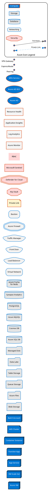

# Azure Icons

```dot
digraph AzureIcons {
    rankdir=LR;

    // Global styles
    graph [fontname="Segoe UI", fontsize=10];
    node  [fontname="Segoe UI", fontsize=9, penwidth=1.2];
    edge  [fontname="Segoe UI", fontsize=8, penwidth=1.0, color="#505050", fontcolor="black"];

    // COMPUTE (dark blue, white font)
    node [shape=box3d, style=filled, fillcolor="#0078D4", fontcolor="white"];
    azure_vm         [label="Azure VM"];
    azure_vmss       [label="VM Scale Set"];
    azure_appservice [label="App Service"];
    azure_function   [label="Function App"];
    azure_container  [label="Container Instance"];
    azure_aks        [label="AKS Cluster", shape=note];
    azure_batch      [label="Batch Account"];

    // STORAGE (light gray, black font)
    node [shape=folder, fillcolor="#E5E5E5", color="#0078D4", fontcolor="black"];
    azure_blob     [label="Blob Storage"];
    azure_files    [label="Azure Files"];
    azure_queue    [label="Queue Storage"];
    azure_table    [label="Table Storage"];
    azure_datalake [label="Data Lake"];
    azure_disk     [label="Managed Disk"];

    // DATABASES (light gray, black font)
    node [shape=cylinder, fillcolor="#E5E5E5", color="#0078D4", fontcolor="black"];
    azure_sql      [label="Azure SQL DB"];
    azure_cosmos   [label="Cosmos DB"];
    azure_mysql    [label="Azure MySQL"];
    azure_postgres [label="PostgreSQL"];
    azure_synapse  [label="Synapse Analytics"];
    azure_redis    [label="Azure Cache\nfor Redis"];

    // NETWORKING (light blue/gray, black font)
    node [shape=box, style="rounded,filled", fillcolor="#F3F2F1", color="#0078D4", fontcolor="black"];
    azure_vnet         [label="Virtual Network"];
    azure_lb           [label="Load Balancer", shape=pentagon];
    azure_frontdoor    [label="Front Door", shape=pentagon];
    azure_traffic      [label="Traffic Manager", shape=pentagon];
    azure_firewall     [label="Azure Firewall", shape=doubleoctagon];
    azure_bastion      [label="Bastion"];
    azure_private_link [label="Private Link", shape=note, fillcolor="#FFF4CE", color="#D83B01", fontcolor="black"];

    // SECURITY (light red, black font)
    node [style=filled, fillcolor="#FFD6D6", color="#D83B01", fontcolor="black"];
    azure_keyvault [label="Key Vault", shape=octagon];
    azure_defender [label="Defender for Cloud", shape=doubleoctagon];
    azure_sentinel [label="Microsoft Sentinel"];
    azure_rbac     [label="RBAC", shape=plaintext];

    // MONITORING (very light gray, black font)
    node [style=filled, fillcolor="#F5F5F5", fontcolor="black"];
    azure_monitor      [label="Azure Monitor"];
    azure_loganalytics [label="Log Analytics"];
    azure_appinsights  [label="Application Insights"];
    azure_health       [label="Resource Health"];

    // IDENTITY (dark blue, white font)
    node [shape=oval, style=filled, fillcolor="#0078D4", fontcolor="white"];
    azure_ad   [label="Azure AD"];
    azure_b2c  [label="Azure AD B2C"];
    azure_mfa  [label="MFA Service"];

    // SPECIAL CONNECTORS (black font, labels via xlabel)
    node [shape=point, width=0.1, height=0.1];
    azure_peering      [label="", xlabel="Peering", fontcolor="black"];
    azure_expressroute [label="", xlabel="ExpressRoute", fontcolor="black"];
    azure_vpn          [label="", xlabel="VPN Gateway", fontcolor="black"];

    // LEGEND
    subgraph cluster_legend {
        label="Azure Icon Legend";
        style="rounded";
        labelloc="b";

        LegendCompute [label="Compute", shape=box3d, fillcolor="#0078D4", fontcolor="white", style=filled];
        LegendStorage [label="Storage", shape=folder, fillcolor="#E5E5E5", color="#0078D4", fontcolor="black", style=filled];
        LegendDb      [label="Database", shape=cylinder, fillcolor="#E5E5E5", color="#0078D4", fontcolor="black", style=filled];
        LegendNet     [label="Networking", shape=box, style="rounded,filled", fillcolor="#F3F2F1", color="#0078D4", fontcolor="black"];
        LegendSec     [label="Security", shape=octagon, style=filled, fillcolor="#FFD6D6", color="#D83B01", fontcolor="black"];

        // Connection Examples
        LegendConn1 [shape=point];
        LegendStandard [label="Standard"];
        LegendConn1 -> LegendStandard [label="Standard", fontsize=8];

        LegendConn2 [shape=point];
        LegendPrivate [label="Private Link"];
        LegendConn2 -> LegendPrivate [label="Private Link", fontsize=8, style=dotted, dir=both, color="#0078D4"];
    }
}
```
